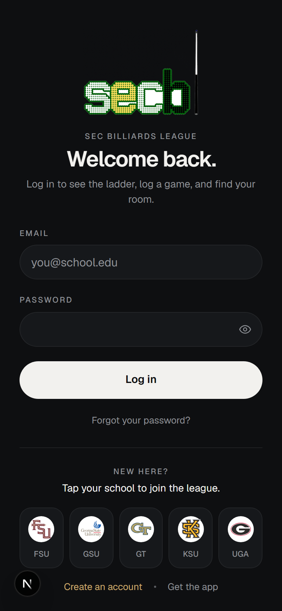
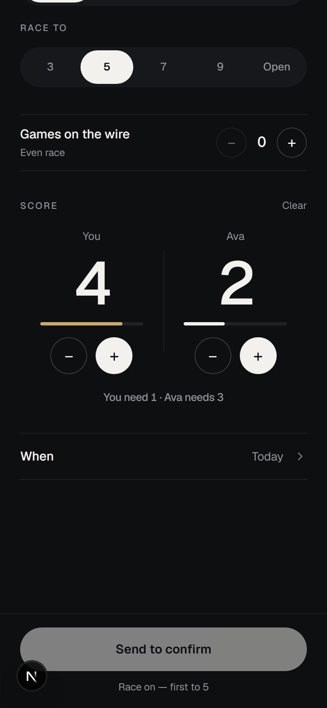
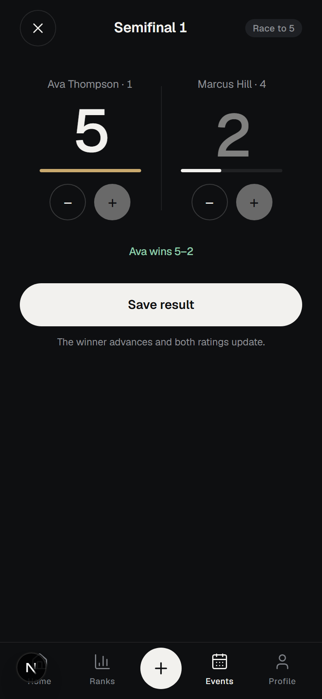
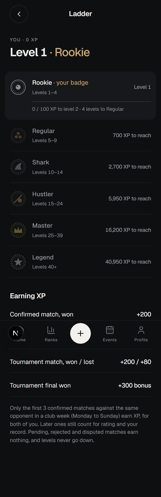
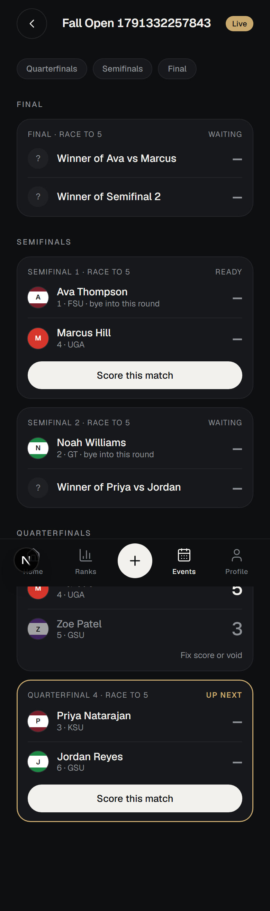
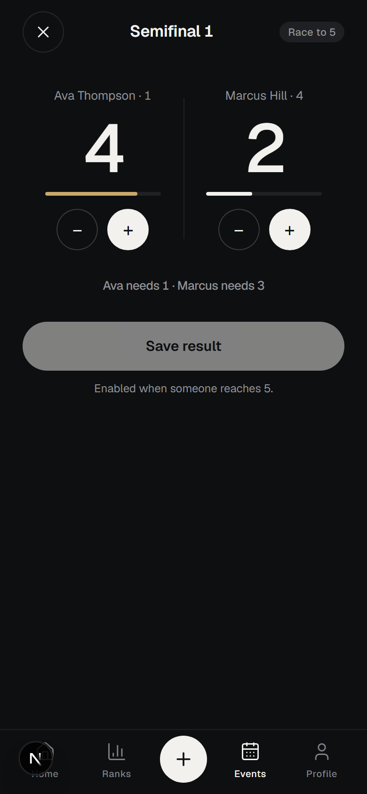
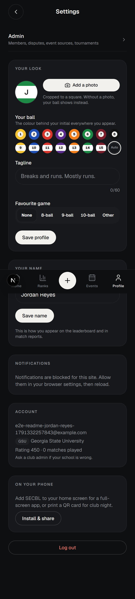
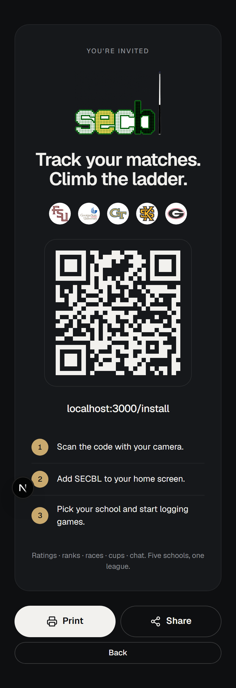

# SECBL — SEC Billiards League

A mobile-first web app for a college billiards league across five schools. Members log games from
the table, confirm each other's results, climb a Fargo-style rating ladder and an XP ladder with
title badges, run cups with seeded brackets, keep a calendar with RSVPs, and chat in league, school
and direct rooms, with push notifications they control. Installs to the home screen as a PWA.

**Live:** https://secbl.vercel.app · **Stack:** Next.js 16 (App Router, Server Actions) · React 19 ·
TypeScript · Tailwind 4 · Supabase (Postgres, Row Level Security, Realtime, Storage, Auth) ·
Web Push (VAPID) · Vitest · Playwright · Vercel

<p align="center">
  
  
  
  
</p>

## What it does

- **Log a game as a live scoreboard.** Pick the opponent, the game (8/9/10-ball) and the race
  (3/5/7/9 or open). The stronger player can give games on the wire; the app suggests a fair spot
  from the rating gap. Two hero numbers on rails fill toward the finish, the winner's number pops,
  the loser's settles, and the result goes to the opponent to confirm. A half-played race survives a
  locked phone.
- **Ratings that can't drift.** Fargo-style Elo (a 100-point gap is 2:1 odds). Every rating write
  goes through one database function under an advisory lock, and the current ladder always equals a
  replay of confirmed matches. Spots never change rating or XP.
- **Levels and badges.** XP for every confirmed game, more for a win, capped per opponent per week
  so friends can't farm it. Six title badges from Rookie to Legend, a ladder screen, a next-badge
  teaser.
- **Cups.** Admins seed by tapping players in order (or draw at random), start a single-elimination
  bracket with byes to the top seeds, and score each match on its own sheet with rails toward the
  cup's race length. Members watch the bracket update live. Results are real rated games; wrong
  scores can be fixed and wrong winners voided, with the ladder replayed.
- **Events and RSVP**, including feeds synced from school calendars.
- **Chat.** League room, a room per school, and direct messages that don't exist until the first
  message is sent. Inbox ordered by latest activity and re-sorted live.
- **Push notifications** for messages, matches and events, each switchable, suppressed for the
  screen you're already looking at, with shared-device subscriptions re-owned on login.
- **Admin:** suspensions, race-aware dispute resolution, event sources, school logos.

<p align="center">
  
  
  
  
</p>

## How it's built

- **Server-first.** Pages are React Server Components reading through the user's own Supabase
  client, so Row Level Security is the real authorization layer. Writes are Server Actions; the
  browser only inserts chat messages, uploads to Storage and subscribes to push.
- **Pure logic, tested first.** The rating engine, bracket generation, race and spot rules, XP and
  levels, chat ordering, push recipients and date handling live in `lib/*.ts` with no I/O, covered
  by Vitest. Integration tests exercise RLS and the SQL functions against a real project; Playwright
  drives the flows end to end (signup, logging and confirming a race, a cup to a champion, DMs with
  live delivery, password reset, logout).
- **Single source of truth for anything that matters.** Ratings, brackets and room membership are
  written only by `SECURITY DEFINER` functions in `supabase/migrations/`; the app never updates
  those tables directly. Levels and achievements are computed from match history, never stored.
- **Designed, not themed.** One dark design system (tokens, hairlines, a brass accent, Geist), a
  locked viewport and native touch behaviour so it feels like an app when installed.

## Run it

```bash
cp .env.example .env.local   # Supabase URL + anon + service keys, and the VAPID push keys (`npx web-push generate-vapid-keys`)
npm install
npm run dev                  # http://localhost:3000
```

Database changes are SQL files in `supabase/migrations/`, applied in order to a Supabase project.

## Verify

```bash
npm run lint
npx tsc --noEmit
npx vitest run --exclude "tests/*.integration.test.ts"   # pure logic, no network
npx vitest run                                           # + RLS/messaging/push tests against the live project
npx playwright test --workers=1                          # e2e; parallel runs are flaky from cold compiles, not bugs
npm run build
```

The integration and e2e suites create and delete real rows in the configured Supabase project.
Teardown lives in `afterEach` (`e2e/cleanup.ts`).

## Deploy

Vercel is not git-connected. From this directory: `npx vercel deploy --prod --yes`. `vercel.json`
schedules a daily health check that keeps a free-tier database from pausing, and a daily event sync.

## Where things are

| Path | What |
|---|---|
| `app/(public)` | login, signup (tap-your-school picker), password reset, install guide and invitation card |
| `app/(member)` | everything behind login: home, log a game, events (+ cups), leaderboard, players, chat, settings, admin |
| `lib/rating.ts`, `lib/bracket.ts`, `lib/seeding.ts`, `lib/race.ts`, `lib/levels.ts`, `lib/chat.ts`, `lib/inbox.ts`, `lib/push.ts`, `lib/events.ts` | pure, test-first logic |
| `lib/push-send.ts`, `public/sw.js` | Web Push: server-side send (VAPID, service role) and the service worker that shows it |
| `supabase/migrations` | schema, RLS, SECURITY DEFINER functions (the only write path for ratings, brackets, membership) |
| `docs/superpowers/specs` | design specs per feature; `plans/` the implementation plans |

## Invariants worth knowing

- Ratings are never written from the browser; every rating write goes through
  `apply_match_confirmation` / the tournament functions under one advisory lock, and current
  ratings always equal a replay of confirmed matches.
- Match scores are stored as the scoreboard showed them: a spot (games on the wire) is already
  inside the receiver's score, so `winner_id` is always the higher score. `race_to` null means open
  play. Spots never change rating or XP.
- Chat DMs are visible to exactly the two participants — admins included out.
- PostgREST caps every response at the project's Max Rows (1000) whatever `.range()` asks for.
  Whole-table scans page through `lib/paging.ts`.
- Push notifications are a courtesy, never part of the write: every trigger runs after the row is
  saved and swallows its own failures. A message's push is claimed by stamping
  `messages.notified_at` first, so it can only fire once.
- All date/time logic goes through `lib/events.ts` (`America/New_York`); the server runs in UTC.

## License

MIT — see `LICENSE`.
